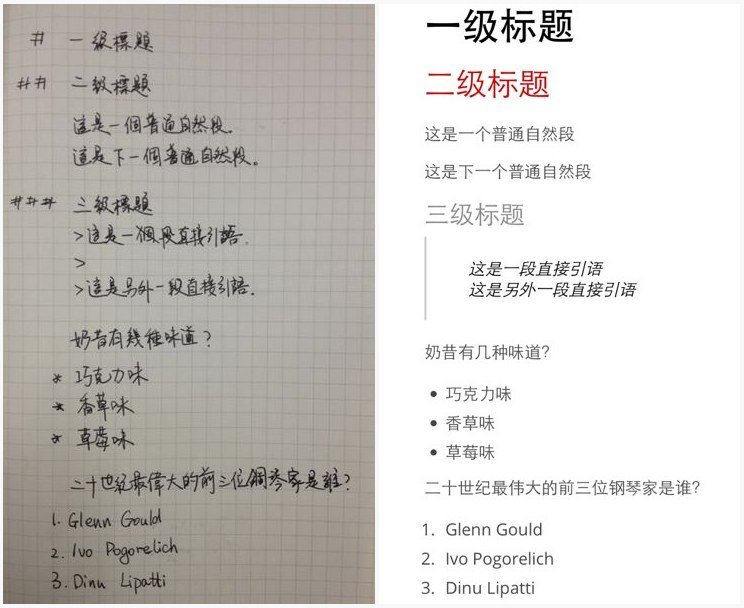

# markdown

!SLIDE

# What format will you save in when you write something down?


!SLIDE

## Plain txt


!SLIDE

## Microsoft Word


!SLIDE

## HTML


!SLIDE

## Any others ?


!SLIDE


### a _lightweight_ markup language

!NOTE

Image credit to http://cargocollective.com/inami/Markdown


!SLIDE

## [Markup](http://en.wikipedia.org/wiki/Markup_language) language:

- HTML
- XML
- Letex

!NOTE

And, Ericsson CPI document source format, generate with TagTool


!SLIDE

# You may have seen it ...

!NOTE

- [GitHub](https://github.com/aleung/fmd): README.md
- [StackOverflow](http://stackoverflow.com/a/8562313/94148)


!SLIDE

## Markdown syntax



!NOTE

- Text base


!SLIDE

## More Markdown syntax

```

text in **bold**, a [link](http://google.com)


	void helloWorld() {
		System.out.printf("Hello, world!");
	}
```


!SLIDE

text in **bold**, a [link](http://google.com)


	void helloWorld() {
		System.out.printf("Hello, world!");
	}

!SLIDE

# Why Markdown?


!SLIDE

## Easy

!NOTE

- 直觉的语法


!SLIDE

## Fast

!NOTE

- Focus on content, not format


!SLIDE

## Clean

!NOTE

- Dirty HTML generated by WYSIWYG editor. Malform. Invalid tags.


!SLIDE

## Portable

!NOTE

- Text
- Cross platform
- Any editor
- Small
- Version history


!SLIDE

# How to use?


!SLIDE

## Editor

- [Mou](http://mouapp.com/) (Mac OSX)
- [MarkdownPad](http://markdownpad.com/) (Windows)
- [MaDe](https://chrome.google.com/webstore/detail/oknndfeeopgpibecfjljjfanledpbkog) (Chrome)


!SLIDE

## Blog

Jekyll / Octopress


!SLIDE

## Presentation

Lots of HTML5 presentation tools support Markdown:

Hekyll, SlideDown, ShowOff, Himpress, KeyDown


!SLIDE

# What's stopping you?

### Any questions?

